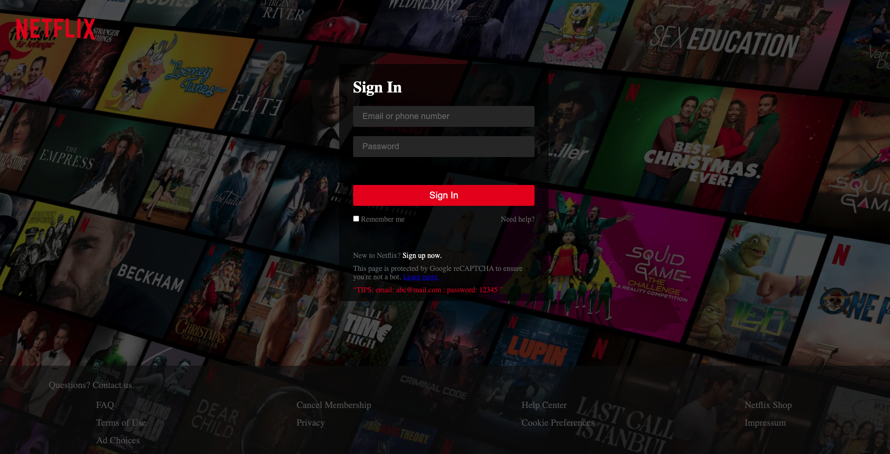
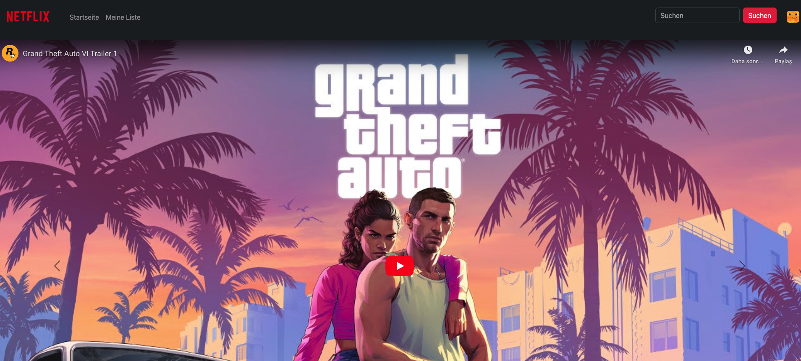
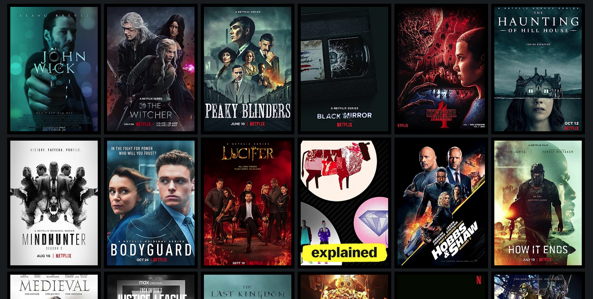
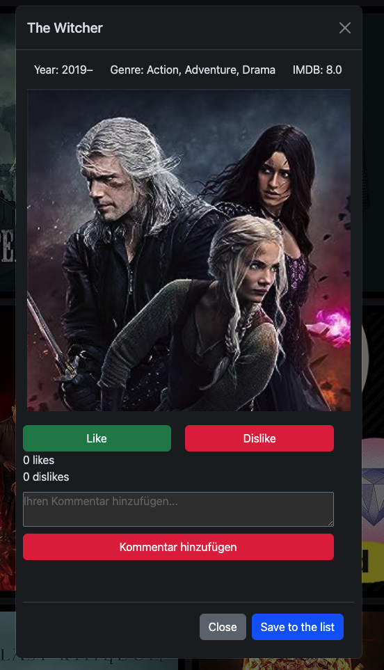
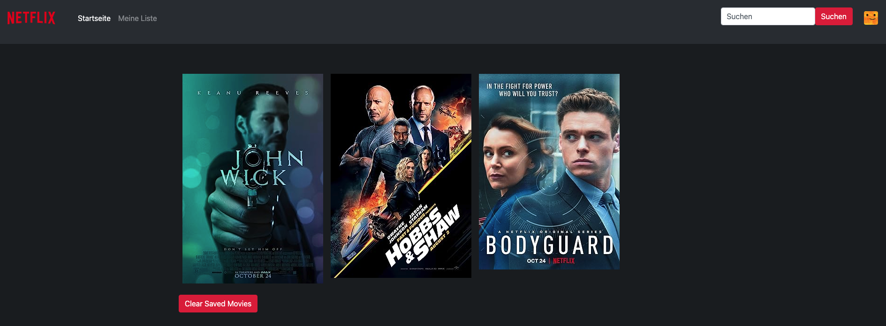
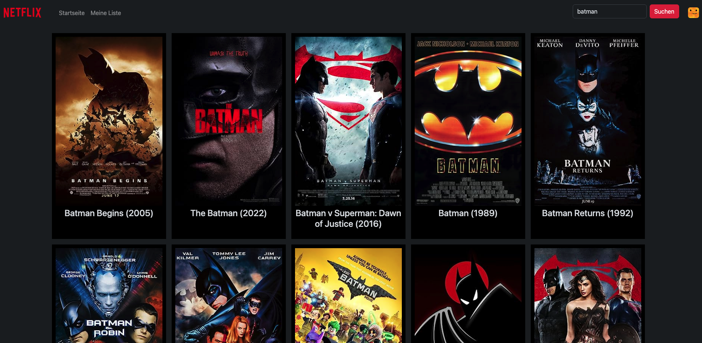

# Netflix-Film-Anwendung mit OMDB-API und Lokaler Authentifizierung

## Projektübersicht

Dieses umfangreiche Projekt einer Netflix-Filmanwendung integriert nicht nur die [OMDB API](http://www.omdbapi.com/apikey.aspx) für den Abruf von Filmdaten, sondern enthält auch eine lokale Authentifizierung für eine Login-Seite. Ziel ist es, Benutzern eine personalisierte Erfahrung zu bieten, indem sie sich anmelden können, um ihre bevorzugten Filme zu speichern und mit anderen Benutzern zu interagieren.

## Verwendete Technologien

- **HTML & CSS (SCSS):** Die Anwendung nutzt HTML und SCSS für das Layout und die Gestaltung der Benutzeroberfläche.

- **JavaScript:** JavaScript wird verwendet, um Filmdaten von der OMDB API abzurufen, dynamische Modals zu erstellen und verschiedene Funktionen wie Kommentare, Likes, Dislikes sowie die lokale Authentifizierung zu implementieren.

- **Fetch API:** Die Fetch API wird für AJAX-Anfragen an die OMDB API verwendet, um Filmdaten zu erhalten.

- **Bootstrap (Modal):** Bootstrap wird für die Modal-Komponenten verwendet, um Filmdetails anzuzeigen und die Benutzeroberfläche zu verbessern.

- **Lokaler Speicher (Session Storage):** Die lokale Authentifizierung wird mithilfe des Session Storage umgesetzt, um Benutzerinformationen zwischen den Seiten zu speichern.

## Projektaufgaben

1. **OMDB API Key erhalten:**

   - Ein API-Schlüssel wurde von der [OMDB-Website](http://www.omdbapi.com/) bezogen, um den Zugriff auf Filmdaten zu ermöglichen.

2. **Abrufen von Filmdaten:**

   - Mit JavaScript wurden Anfragen an die OMDB API gestellt, um Filmdaten zu erhalten.
   - Die Fetch API wurde verwendet, um Daten abzurufen und im HTML anzuzeigen.

3. **Gestaltung & Layout:**

   - HTML und SCSS wurden verwendet, um ein ansprechendes Layout zu erstellen, das dem von Netflix ähnelt.
   - Karten für Filmdetails wurden entworfen und gestylt.

4. **Zusätzliche Funktionen implementieren:**

   - Kommentare: Benutzer können Kommentare zu Filmen hinzufügen.
   - Likes & Dislikes: Funktionen wurden implementiert, um Filme zu Liken oder Disliken.
   - Lokaler Speicher: Kommentare, Likes und Dislikes werden im lokalen Speicher des Browsers gespeichert.

5. **Lokale Authentifizierung hinzufügen:**

   - Erstellung einer Login-Seite.
   - Verwendung des Session Storage, um Benutzerinformationen zu speichern.
   - Sicherstellung, dass bestimmte Seiten nur für angemeldete Benutzer zugänglich sind.

6. **Testen:**
   - Überprüfung der korrekten Funktionsweise der Filmdatenabfrage und der zusätzlichen Features.
   - Authentifizierungstests, um sicherzustellen, dass Benutzer korrekt angemeldet werden und auf geschützte Seiten zugreifen können.

## Ressourcen

- [OMDB API-Dokumentation](http://www.omdbapi.com/)
- [Mozilla Developer Network (MDN)](https://developer.mozilla.org/en-US/)
- [Bootstrap-Themen](https://bootswatch.com/)

## Fazit

Dieses Projekt bietet nicht nur eine umfassende Filmanwendung, sondern integriert auch eine lokale Authentifizierung für eine personalisierte Benutzererfahrung. Durch den Einsatz verschiedener Technologien und die Integration zusätzlicher Funktionen schafft die Anwendung eine ganzheitliche Plattform für Filmliebhaber.

- Login Seite
  
- Header
  
- Body
  
- Modal
  
- Meine Liste
  
- Suchseite
  
